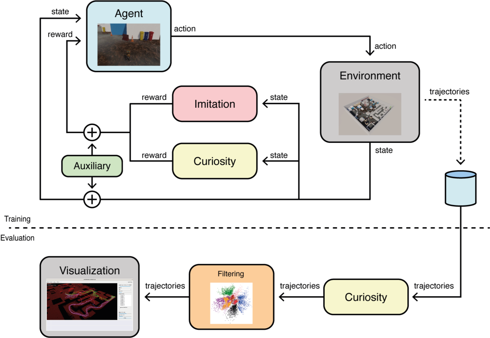

# CCPT
Official codebase for *"Automatic Gameplay Testing and Validation with Curiosity-Conditioned Proximal Trajectories"* paper.
Alessandro Sestini, Linus Gisslén, Joakim Bergdahl, Konrad Tollmar, and Andrew D. Bagdanov.

This repo contains the Curiosity-Conditioned Proximal Trajectories (CCPT) algorithm (Algorithm 1 in the paper).

A link to our paper can be found in [arxiv](https://arxiv.org/pdf/2202.10057)

For the visualization tool, see this [repo](https://github.com/SestoAle/VisCCPT).

<br/>
<p align="center">
    
</p>

# Prerequisites
* The code was tested with **Python v3.6**.
* To install all required packages:
```
git clone https://github.com/SestoAle/CCPT.git
cd CCPT
pip install -r requirements.txt
pip install mlagents==0.5.0 --no-deps
```
* To donwload the environment and the demonstrations:
```
python download_data.py
sudo chmod +x games/Playtesting_Final.x86_64
```
# Instruction
* To train the agent to playtest the environment, use the command:
```
python train_ccpt.py -ga=1 -dn=dem_playtest_1.pkl -gn=games/Playtesting_Final -mn=playtest_1
```
where ```-ga``` specifies the goal area we want to test, ```-dn``` the name of the demonstrations to use, ```-gn``` 
the name of the environment and ```-mn``` the name with which we save the results.

# Visualization Tool
To visualize results, we suggest to visit the [```VisCPPT```](https://github.com/SestoAle/VisCCPT) repo, which contains the visualization tool described 
in the paper. 